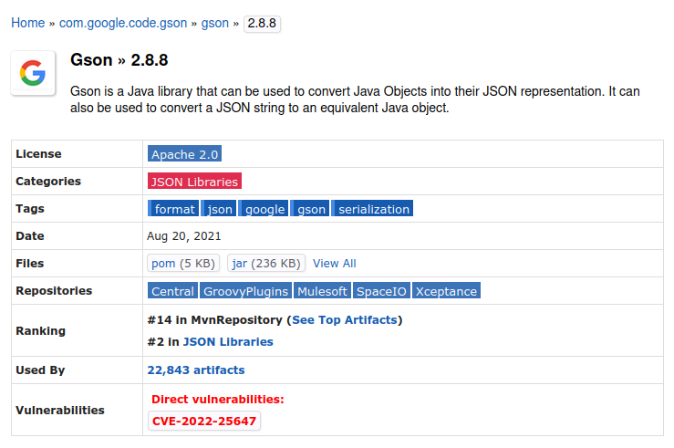

# Skeleton Project for OWASP and Sonarqube Analysis

This is a sample git repos to facilitate the git checkout step of the Jenkins pipeline that implements the OWASP and Sonarqube analysis reporting.

### Project Structure:
We have used this skeleton Spring Boot 3 application as a demo source code repo. \
\
We have used following gradle plugins in the build.gradle file.\
[OWASP dependencycheck gradle plugin](https://plugins.gradle.org/plugin/org.owasp.dependencycheck)\
[SonarQube gradle plugin](https://docs.sonarsource.com/sonarqube/latest/analyzing-source-code/scanners/sonarscanner-for-gradle/#analyzing)

### OWASP Analysis

In order to depict a CVE vulnerability in the project dependencies, we have used following dependency which has a CVE vulnerability.



```
// note that this dependency version caries a known CVE vulnerability
// From the version "2.8.9" on the vulnerability has been patched
implementation 'com.google.code.gson:gson:2.8.8'
```

Execute the following command in terminal to run the OWASP dependency analysis gradle task:
```
./gradlew dependencyCheckAnalyze
```


The generated OWASP dependency analysis report is available at following location.
```
.
├── build
    ├── reports
        └── owasp-dep-check
            └── dependency-check-report.html
```

We can open the html file in a web browser to find additional information on the vulnerabilities identified from the OWASP analysis.


### Sonarqube Analysis

We have configured the following properties in the gradle task for Sonarqube analysis.

```
sonar {
    properties {
        property('sonar.projectKey', 'demo-service-key')
        property('sonar.projectName', 'demo-service')
	property('sonar.host.url', 'http://localhost:9000/')
	property('sonar.token', project.hasProperty('sonar.token') ? project.getProperty('sonar.token') : "")
    }
}
```

\
Execute the following command in terminal to run the Sonarqube analysis gradle task:
```
./gradlew sonar
```

Once the Sonarqube analysis is done we can utilize the web api provided to fetch the component metrics.
\
We have used the [following GET endpoint](https://next.sonarqube.com/sonarqube/web_api/api/measures/component)([local sonarqube instance url](http://localhost:9000/web_api/api/measures/component)) to fetch component metrics.
\
Available metric keys and their definitions can be found from the docs available in [here](https://docs.sonarsource.com/sonarqube/latest/user-guide/code-metrics/metrics-definition/).


```http
GET /api/measures/component
```

| Parameter | Type     | Description                                                     | Example Value |
| :-------- | :------- |:----------------------------------------------------------------|---------------|
| `metricKeys` | `string` | **Required**. Comma-separated list of metric keys               |code_smells,duplicated_blocks,alert_status,bugs,vulnerabilities,security_rating,coverage|
| `component` | `string` | **Required**. "sonar.projectKey" specified in gradle sonar task |demo-service-key|


\
Example CURL request(note that we are parsing the response to jq to format the output):
```
curl -X GET -u {sonarqube_user_token}: "http://localhost:9000/api/measures/component?metricKeys=code_smells,duplicated_blocks,alert_status,bugs,vulnerabilities,security_rating,coverage&component={project-key-specified-in-gradle-sonar-task}" | jq '.'
```

Response from Sonarqube API:
```
{
  "component": {
    "key": "demo-service-key",
    "name": "demo-service",
    "qualifier": "TRK",
    "measures": [
      {
        "metric": "alert_status",
        "value": "ERROR"
      },
      {
        "metric": "security_rating",
        "value": "1.0",
        "bestValue": true
      },
      {
        "metric": "vulnerabilities",
        "value": "0",
        "bestValue": true
      },
      {
        "metric": "bugs",
        "value": "8",
        "bestValue": false
      },
      {
        "metric": "code_smells",
        "value": "247",
        "bestValue": false
      },
      {
        "metric": "coverage",
        "value": "0.0",
        "bestValue": false
      },
      {
        "metric": "duplicated_blocks",
        "value": "16",
        "bestValue": false
      }
    ]
  }
}

```

